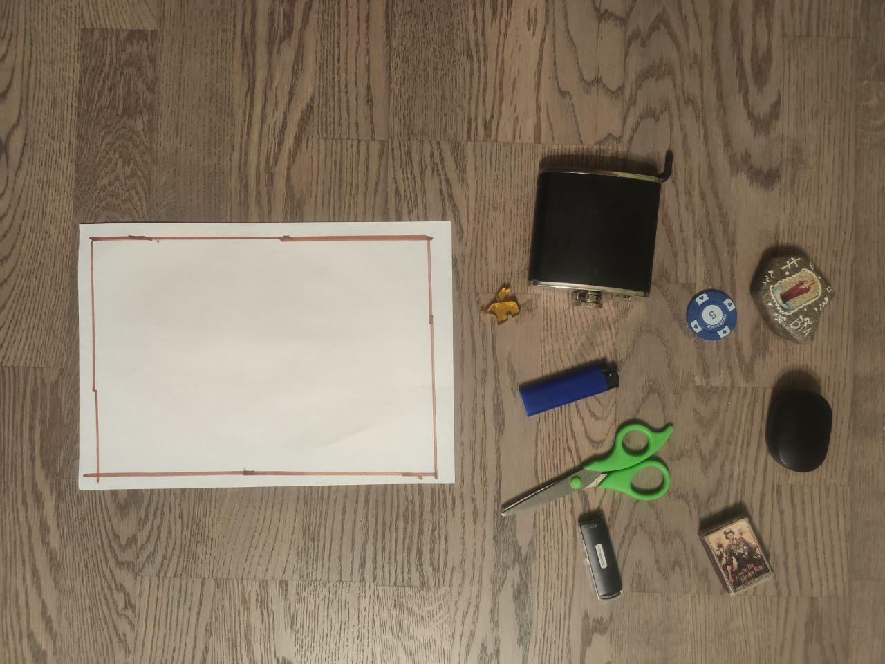
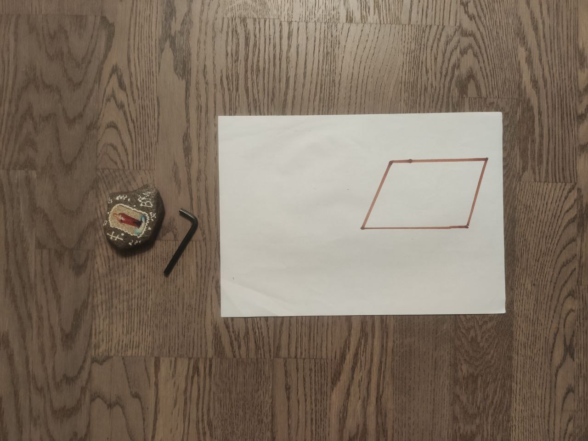
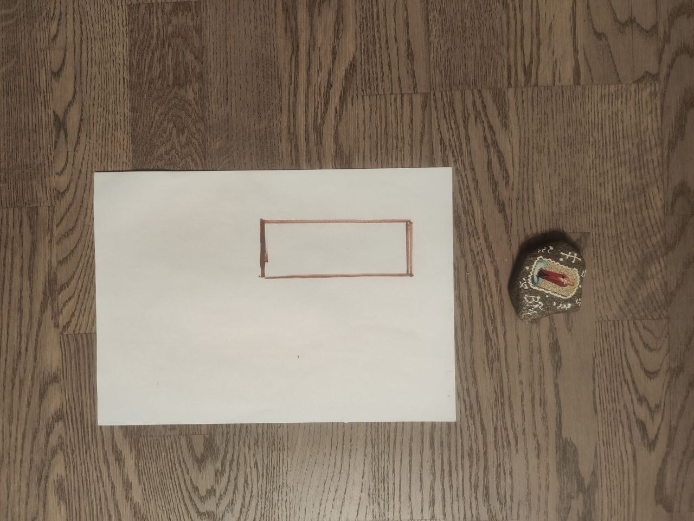
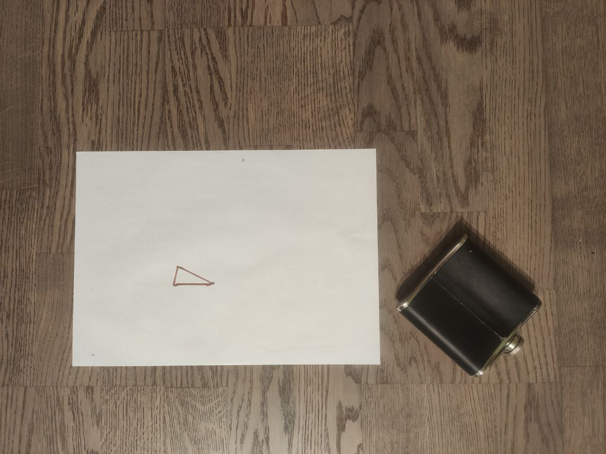
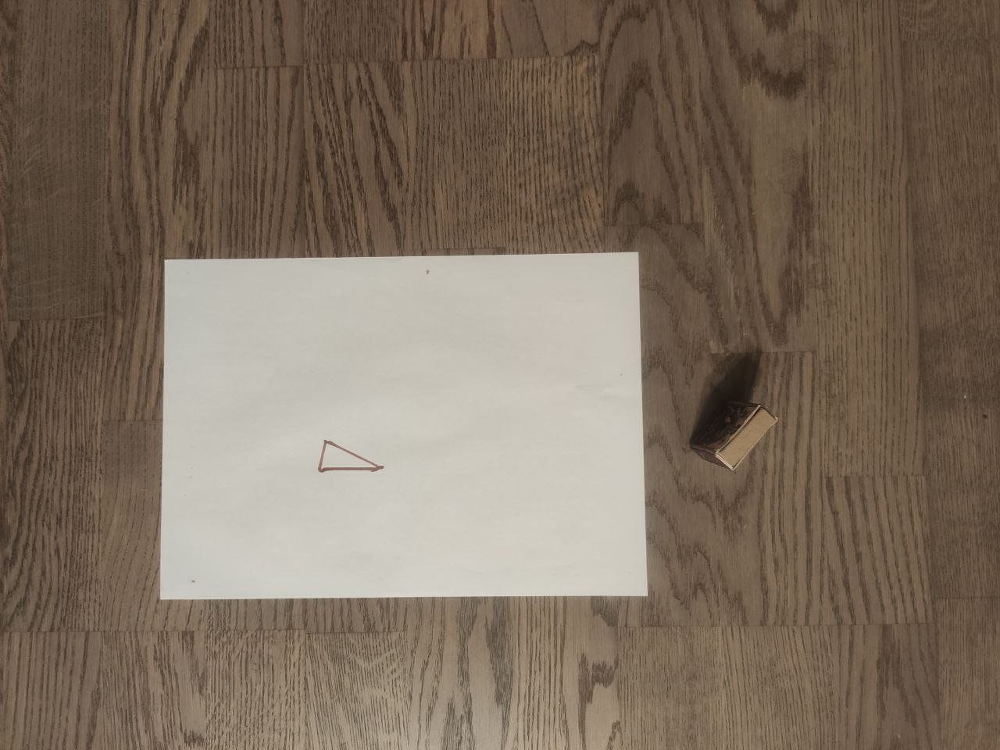
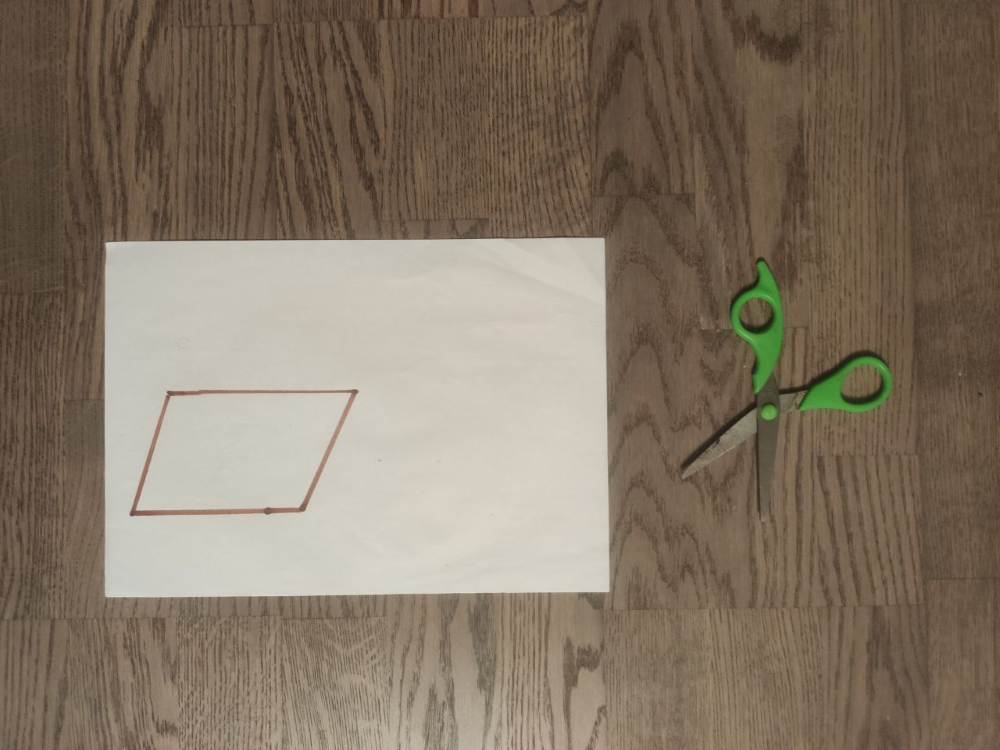

#Описание тестов
1)
Проверка на присутствие объекта.

Ответ: False
2)
Проверка на присутствие многоугольника.

Ответ: False
3)
Многоугольник относительно большой площади, но куда не поместиться даже самый маленький объект.

Ответ: False
4)
Весь представленный набор предметов помещается в многоугольник (предметы не накладываются друг на друга)

Ответ: True
5)
Представленые предметы еле-еле, но помещаются в многоугольник

Ответ: True
6)
Предмет не помещается в многоугольник.

Ответ: False
7)
Диаметр объекта схож с шириной треугольника и помещается туда, не залезая за края.

Ответ: True
8)
Диаметр объекта схож с шириной треугольника и не помещается туда, потому что залезает за края за края.

Ответ: False
9)
Очевидно, объект не помещается в многоугольник

Ответ: False
10)
Объект перевёрнут - фляга, в данном случае, лежит не на той стороне, на которой должна (именно поэтому false)

Ответ: False
11)
Объект перевёрнут (тоже самое, что и с флягой) (именно поэтому false).

Ответ: False
12)
Ножницы были изначально должны быть закрыты.

Ответ: False
13)
Предмет сопоставим с границами и помещается туда.

Ответ: True
14)
Предмет залезает на край поверхности, на которой изображён многоугольник.

Ответ: False
15)
Предмет залезает на многоугольник.

Ответ: False
16)
Два многоугольника.

Ответ: False
17)
Предметы расположены по разные стороны от многоугольника.

Ответ: False
18)
Изображение сделано слишком близко (например, не видно края поверхности, на которой изображён многоугольник).

Ответ: False
